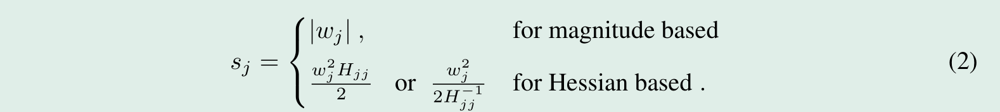

# Single-shot network pruning based on connection sensitivity

复现 [SNIP: Single-shot network pruning based on connection sensitivity](https://arxiv.org/abs/1810.02340)

基于连接重要性的稀疏剪枝。

---

## 摘要

作者提出了一种名为 SNIP 的网络剪枝方法，在训练前的初始化阶段一次完成剪枝。

引入基于连接重要性的指标来定位当前任务中的重要连接。

剪枝后，稀疏的网络按照常规训练。

## 1 Introduction

大部分现有方法都是基于显著性准则在预训练的网络中寻找权重的子集，或是使用稀疏性惩罚。

它们都需要大量的剪枝-再训练迭代，以及额外的超参数。

作者提出一种依赖于数据的准则，在训练前确定重要的连接。

    1. 简单。没有额外的超参数。
    2. 架构多样性。可以用于不同的网络结构上。
    3. 可解释性。可以验证保留的连接确实是重要的。

---

## 2.相关工作

### 2.1 经典方法

使用稀疏惩罚项或是某些显著性准则。

### 2.2 现代进展

基于 Hessian 的方法使用对角线近似来简化计算，这使得基于权重量级的准则得到广泛应用，取得瞩目的成果，甚至扩展到了循环神经网络。

然而它们需要调节众多超参数，以及大量的剪枝-再训练迭代，同时难以扩展到新的网络结构和不同的任务上。

### 2.3 一般的网络压缩

略

---

## 3. 神经网络剪枝

剪枝的目的是找到一个稀疏的网络，同时保证其准确率。

对于数据集 D，和期望的稀疏度 k，剪枝可以描述为以下的优化问题：


传统方法通过增加稀疏惩罚项来优化上述问题，最近也有人使用梯度下降投影的随机版本来解决上述问题，但它们都不如基于显著性准则的方法，且需要众多超参数。

基于显著性的方法通过选择性地移除冗余连接来解决上述问题，因此需要一个好的准则。常见的准则包括权重量级和 loss 对于权重的 Hessian 矩阵，显著性计算如下：



Hessian 矩阵往往既不正定也不对角，不适用于大型的网络。

这些指标依赖于权重的大小范围，需要预训练，而且对结构选择敏感。例如不同的归一化层对权重的范围影响不同，而且需要大量的剪枝-再训练循环。

## 4. 基于连接重要性的稀疏剪枝

作者设计了一个指标可以直接衡量与数据相关的连接重要性。

### 4.1 连接重要性：架构视角

引入一个辅助变量 C，它的值只包含 0 和 1，大小与连接数相当，用于表示参数的连接与否，则之前的优化问题可以重写如下：


将参数翻倍后，直接优化上述问题变得更加困难。但是通过引入 C 来表示连接与否，我们也许可以通过评估连接对 loss 的影响来判断其重要性。

c_j = 1 和 c_j = 0 对 loss 的影响可以写为以下表达式，其中 e_j 为一个除了索引 j 处为 1 其它位置全0的向量。


如果要对每个连接计算其断开后对 loss 的影响，则需要在数据集上执行 m+1 次前向传播，其量级往往在百万级别。

由于 C 是二值化的，因此 loss 对 C 是不可导的， ∆L_j 只能在这种离散的设定下评估连接 j 对 loss 的影响。

通过解除对 C 的二值约束，可以使用 loss 对 C_j 的偏导 g_j(W;D) 来近似 ∆L_j，则连接 j 对 loss 的影响可以重写为：


事实上，∂L/∂C_j 是 ∆L_j 的无穷小版本，用于估计当 c_j 由 1 → 1-δ 时 loss 的变化率，通过使用自动微分，可以在一次前向过程中高效地计算出来。

使用 g_j 的绝对大小作为显著性准则，根据稀疏度 k，仅保留得分最高的 int((1 - k_ratio) * weight_num) 个连接。

### 4.2 关于初始化

为了确保梯度在一个合理的范围内，网络的初始化非常重要。

即使初始化的权重有固定的方差，通过各层后的信号也不能保证有相同的方差，这会使得本文的显著性准则依赖于网络特征。

使用方差缩放方法(xavier_normal)初始化权重，能够使得整个网络中方差保持相同。

根据实际的需要，可以选择使用整个数据集或者一个小批量又或是验证集来计算连接重要性，在有内存限制的情况下，可以选择累积重要性或是做指数滑动平均。

算法流程如下：


---

## 5. 实验

作者的开源代码仓库 [snip-public](https://github.com/namhoonlee/snip-public)。

项目结构如下：
  - utils.py: 绘图工具，以及各实验的配置
  - dataload.py: 加载 minst 数据集和 cifar-10 数据集(增强)。
  - train.py: 训练网络，评估测试集精确率。
  - layers.py: 掩码层
  - models.py: 由掩码层组成的与原网络相当的网络

首先设计一个掩码层的基类，主要实现功能包括获取掩码的梯度和评估重要性后固定掩码，以及初始化参数。

```python
class BaseMaskedLayer(nn.Module):
    def __init__(self, masked=False):
        super(BaseMaskedLayer, self).__init__()
        if not masked:
            device = torch.device("cuda:0")
            if isinstance(self.weight_shape, list):
                self.mask = []
                for weight_shape in self.weight_shape:
                    mask = torch.ones(weight_shape, requires_grad=True, device=device)
                    self.mask.append(mask)
            else:
                self.mask = torch.ones(self.weight_shape, requires_grad=True, device=device)

    def forward(self, *args):
        raise NotImplementedError

    def apply_mask(self, mask):
        self.mask.requires_grad = False
        self.weight.grad.zero_()
        mask = mask.view(self.weight_shape).float()
        self.weight.register_hook(lambda grad: grad * mask)
        self.mask[:] = mask

    def get_grad(self):
        if isinstance(self.mask, list):
            res = []
            for mask in self.mask:
                res.append(mask.grad.view(-1))
            return torch.cat(res)
        return self.mask.grad.view(-1)

    def init_parameters(self):
        nn.init.xavier_normal_(self.weight)

    @property
    def weight_numel(self):
        return self._weight_num
```

设计一个网络的基类，主要实现功能包括获取各层掩码的梯度和评估连接重要性，以及保存和加载网络参数。

```python
class BaseModel:
    def __init__(self, net):
        self.net = net
        self.sparsity_ratio = 0

    def __call__(self, x):
        return self.net(x)

    def __getitem__(self, index):
        return self.net[index]

    def get_masks_grad(self):
        weight_num = 0
        mask_grad = []
        for layer in self.net:
            if isinstance(layer, BaseMaskedLayer):
                mask_grad.append(torch.abs(layer.get_grad()))
                weight_num += layer.weight_numel

        return weight_num, mask_grad

    def apply_masks(self, inputs, loss, k_ratio):
        self.net.train()
        X, y = inputs
        l = loss(self.net(X), y)
        l.backward()

        weight_num, masks_grad = self.get_masks_grad()

        keep_weight_num = int((1 - k_ratio) * weight_num)
        score = torch.cat(masks_grad)
        score_sum = torch.sum(score)
        score.div_(score_sum)
        print(torch.max(score))

        threshold = torch.topk(score, keep_weight_num)[0][-1] * score_sum
        masks = [mask_grad >= threshold for mask_grad in masks_grad]

        self.sparsity_ratio = 1 - torch.sum(torch.cat(masks)) / weight_num

        i = 0
        for layer in self.net:
            if isinstance(layer, BaseMaskedLayer):
                layer.apply_mask(masks[i])
                i += 1

    def load_state_dict(self, state):
        self.net.load_state_dict(state)

    def state_dict(self):
        return self.net.state_dict()

    def parameters(self):
        return self.net.parameters()

    def train(self):
        self.net.train()

    def eval(self):
        self.net.eval()
```

实验设定：

MiNST: epoch, batch_size, lr = 250, 100, 0.1，优化算法为 SGD，momentum=0.9，weight_decay=0.0005。

CIFAR-10: epoch, batch_size, lr = 300, 128, 0.1，优化算法为 SGD，momentum=0.9，weight_decay=0.0005。

训练集的 10% 分割为验证集。

MiNST数据集上每 250K step 学习率衰减为原来的 0.1，CIFAR-10数据集上每 300K step 学习率衰减为原来的 0.1。

训练过程如下，先根据连接重要性剪枝，然后是常规训练，保留验证集上效果最好的网络来测试泛化性能。

```python
def train_net(net, loss, trainer, data_iter, epochs, path, k_ratio, scheduler=None):
    train_iter, val_iter, test_iter = data_iter

    net.apply_masks(next(iter(train_iter)), loss, k_ratio)
    print("true sparsity: %f%%" % (net.sparsity_ratio * 100))

    val_acc_best = 0
    for epoch in range(epochs):
        net.train()
        for X, y in train_iter:
            y_hat = net(X)
            l = loss(y_hat, y)

            trainer.zero_grad()  # 清除了优化器中的grad
            l.backward()  # 通过进行反向传播来计算梯度
            trainer.step()  # 通过调用优化器来更新模型参数
            if scheduler:
                scheduler.step()

        val_acc = evaluate_accuracy(net, val_iter)
        if val_acc > val_acc_best:
            val_acc_best = val_acc
            torch.save(net.state_dict(), path)

        print("epoch: %d    val_acc: %.2f%%" % (epoch + 1, val_acc * 100))

    if val_acc < val_acc_best:
        net.load_state_dict(torch.load(path))

    return 1 - evaluate_accuracy(net, test_iter)
```

### 5.1 在不同稀疏度下对 Lenet 进行剪枝

作者原图


实验结果基本相符

lenet-300-100


lenet-5-Caffe


### 5.2 与现有方法的比较

作者着重强调 SNIP 无额外超参数，不需要增强，且不依赖于网络结构。


实验结果

lenet-300-100, 95%


lenet-300-100, 98%


lenet-5-Caffe, 98%


lenet-5-Caffe, 99%


### 5.3 各种现代网络架构

卷积网络和残差网络使用 cifar-10数据集，循环网络使用 minst 数据集。


实验结果

AlexNet-s


VGG-D


WRN-16-8 


LSTM-s


LSTM-b


#### 5.4 了解哪些连接被修剪

作者使用 minst 和 fashion-minst 数据集，展示不同稀疏度（自上到下，10% -> 90%）下的 LeNet-300-100 的第一层连接情况，亮点表示连接。

可以看到，随着稀疏度增大，连接到前景的连接在剪枝后被保留，而背景的连接被移除。


### 5.5 数据和权重初始化的影响

#### 数据的影响

采用 mini-batch 作为显著性准则计算的数据，batch-size 大小具有影响。

可以看到，随着 batch-size 的增大，保留的连接逐步接近于整个数据集的平均（使用整个数据集保留的连接），错误率逐步下降。


#### 权重初始化的影响

作者使用不同的方法初始化权重，并对比错误率。使用方差缩放方法对 GRU 很重要。


### 5.6 拟合随机标签

使用原网络（红线）和剪枝后的网络（蓝线）拟合真实标签，网络都能很好地拟合。

然而，当我们将训练集中的标签随机打乱时，会发现原网络（绿线）依旧能够拟合，即使加上 L2 正则化（紫线）也无济于事。

而剪枝后的网络（橙线）则无法拟合这种数据集，这说明剪枝后的网络没有过拟合随机标签的能力，仅仅只能拟合真实标签。

这进一步强调了作者提出的显著性准则的重要性。

待补充。


## 6.讨论和未来工作

略

---

## Problems

### 1. 稀疏性固定

使用方差缩放(xavier_normal)对参数进行初始化，对于设定好的 Seed，参数是确定的，自动微分计算得到的 mask 的梯度是确定的，其中往往包含一定数量的 0。

通过设定稀疏度为 0，选择大于阈值来生成 mask，能得到最小的稀疏度（如 Lenet-300-100 为 35%），这种情况下作者绘制较低稀疏度的结果似乎没有意义？

较低稀疏度下阈值为0，若采用大于等于阈值，会得到完全不稀疏的 mask。

### 2. bias 的影响

bias 的初始化对网络的收敛有着重大影响。

使用标准正态分布来初始化 bias，网络往往在训练 10 个 epoch 左右后开始收敛，甚至会出现无法收敛的情况。

以下是 Lenet-5-Caffe 在稀疏度为 98% 下的训练情况，在第 22 个 epoch 时网络开始收敛。


以下是 Lenet-5-Caffe 在稀疏度为 75% 下的训练情况，可以看到 60 个 epoch 后，网络的识别结果依然是随机的。


而将 bias 置为 0 的情况下，网络总是能够在第一个 epoch 就开始收敛。

### 3. Mask 的意义

P = W * M，在计算连接重要性时，M 是与 W 大小相同的全 1 张量，将 P 作为前向传播的权重参数，计算 ∂L/∂M 来度量连接的重要性。

由于 ∂L/∂W = ∂L/∂P * M = ∂L/∂P，则 ∂L/∂M = ∂L/∂P * W = ∂L/∂W * W。

事实上，在计算连接重要性的过程中，P = W，则 loss 对各个权重向量的偏导应当与未加 Mask 时一致。

这说明只需要在原网络中执行前向传播后计算 ∂L/∂W * W，之后将对应位置置为0，并强制其梯度为 0 即可。

进一步的，如果我们允许被断开的连接依旧有可以有梯度，在每个前向传播后权重更新前计算 ∂L/∂W * W，并在下一次前向传播时使用由它生成的 Mask，会有什么效果？

事实是，这不会有任何改变，被置为0的连接，即使其梯度不为0，其重要性度量依旧是0，在下一次前向时它依旧被断开。

那如果使用更新后的权重来计算重要性呢？即 g = ∂L/∂W * (W - ∂L/∂W * lr)，这里 W 实际上是被剪枝后的 W。

这与作者的观点(one-shot)是相悖的，且把事情复杂化了，但值得一试。

以下是实现上述算法的全连接层，使用 save_grad 保存梯度，并在权重更新后使用 get_grad 计算重要性，之后对权重进行剪枝。卷积层同理。

```python
class MaskedLinear_t(BaseMaskedLayer):
    def __init__(self,
                 in_features,
                 out_features,
                 bias=True):
        self.weight_shape = (out_features, in_features)
        self._weight_num = out_features * in_features
        super(MaskedLinear_t, self).__init__()
        del self.mask

        self.weight = nn.Parameter(torch.zeros(self.weight_shape))
        self.init_parameters()
        if bias:
            self.bias = nn.Parameter(torch.zeros((out_features,)))
        else:
            self.bias = None
        self.grad = None

    def forward(self, x):
        output = nn.functional.linear(x, self.weight, self.bias)
        return output

    def save_grad(self):
        self.grad = self.weight.grad.detach()

    def get_grad(self):
        return (self.grad * self.weight).view(-1)

    def apply_mask(self, mask):
        mask = mask.view(self.weight_shape).float()
        with torch.no_grad():
            self.weight *= mask
```

以 Lenet-5-Caffe 为例，cal_mask_trans 用于统计每两个 epoch 开头的 mask 中不相同的元素占比。

```python
class LeNet_5_Caffe_t(BaseModel):
    def __init__(self):
        net = nn.Sequential(
            MaskedConv2d_t(1, 20, 5, padding=0, bias=True), nn.ReLU(),
            nn.MaxPool2d(kernel_size=2, stride=2),
            MaskedConv2d_t(20, 50, 5, padding=0, bias=True), nn.ReLU(),
            nn.MaxPool2d(kernel_size=2, stride=2),
            nn.Flatten(),
            MaskedLinear_t(50 * 4 * 4, 500), nn.ReLU(),
            MaskedLinear_t(500, 10))
        super(LeNet_5_Caffe_t, self).__init__(net.cuda(torch.device("cuda:0")))
        self.i = 0
        self.premasks = None
        self.curmasks = None

    def save_grad(self):
        for layer in self.net:
            if isinstance(layer, MaskedLinear_t) or isinstance(layer, MaskedConv2d_t):
                layer.save_grad()

    def remask(self, k_ratio, save=False):
        weight_num, masks_grad = self.get_masks_grad()

        keep_weight_num = int((1 - k_ratio) * weight_num)
        score = torch.cat(masks_grad)
        score_sum = torch.sum(score)
        score.div_(score_sum)

        threshold = torch.topk(score, keep_weight_num)[0][-1] * score_sum
        masks = [mask_grad >= threshold for mask_grad in masks_grad]

        if save:
            self.curmasks = masks

        self.sparsity_ratio = 1 - torch.sum(torch.cat(masks)) / weight_num

        i = 0
        for layer in self.net:
            if isinstance(layer, BaseMaskedLayer):
                layer.apply_mask(masks[i])
                i += 1

    def cal_mask_trans(self):
        if self.i == 0:
            self.i = 1
            self.premasks = self.curmasks
            return
        cnt, num = 0, 0
        for pre, cur in zip(self.premasks, self.curmasks):
            cnt += torch.sum(pre != cur)
            num += pre.numel()
        print("trans: %f" % (cnt/num))
        self.premasks = self.curmasks
```

对 train_net 进行一些改动
```python
            l.backward()  # 通过进行反向传播来计算梯度
            net.save_grad()
            trainer.step()  # 通过调用优化器来更新模型参数
            if i == 0:
                net.remask(k_ratio, True)
            else:
                net.remask(k_ratio)
```

采用与前文实验相同的配置，训练结果如下，同等稀疏度下，似乎要好于原文中 1.1% 的错误率。


尝试对 VGG-D 进行相似的实验，训练结果如下，同等稀疏度下，似乎与之前的训练结果相差无几，在 epoch 较小时，val_acc 极易发生振荡(50% -> 70% -> 50%)。

